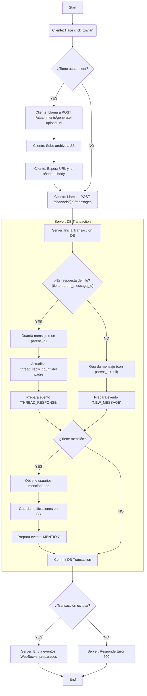
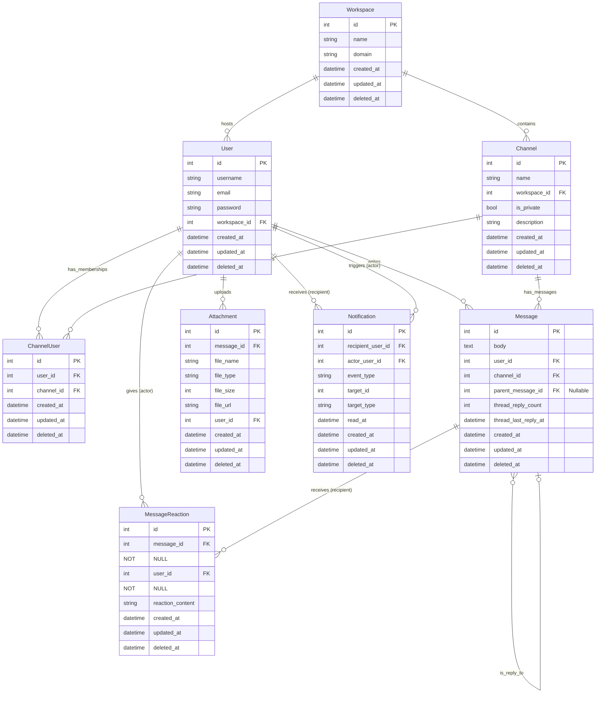

## Introduccion

Este documento describe el diseño tecnico para la API backend de una aplicacion de mensajeria en tiempo real (similar a Slack). La api maneja autenticacion y autorizacion, workspaces, canales, mensajes, attachments con un sistema que guarda los archivos en un servicio como S3 y un sistema de notificaciones centralizado.

## Objetivos claves

- Proveer de una API RESTful segura y escalable.
- Proveer de un servicio de comunicación y notificaciones centralizado para un mejor manejo de los trabajadores.
- Permitir comunicación en tiempo real gracias al servicio de websocket.
- Manejar almacenamiento de archivos de forma desacoplada con un servicio como S3.

## Use cases

### **Caso 1: Comunicación en canales de equipo**

**Scenario:** Un equipo de desarrollo de software necesita discutir el progreso de un sprint en un canal dedicado.

**Flow:**

1.  Un miembro del equipo publica una actualización en el canal #desarrollo.
2.  Otros miembros comentan y reaccionan al mensaje.
3.  Se genera un hilo para discutir una tarea específica sin interrumpir la conversación general.
4.  El equipo recibe notificaciones de nuevos mensajes y menciones relevantes.

### **Caso 2: Mensajes directos entre empleados**

**Scenario:** Un diseñador gráfico necesita pedir aclaraciones a un desarrollador sobre una funcionalidad específica.

**Flow:**

1.  El diseñador busca al desarrollador en la plataforma y le envía un mensaje directo.
2.  El desarrollador recibe una notificación y responde.
3.  Si es necesario, pueden escalar la conversación a una videollamada desde la plataforma.

### **Caso 3 (Opcional): Notificaciones y menciones**

**Scenario:** Un gerente menciona a un empleado en un mensaje para pedirle una actualización.

**Flow:**

1.  El gerente escribe un mensaje en el canal #proyectos y menciona al empleado con @nombre.
2.  El empleado recibe una notificación en su aplicación.
3.  El empleado responde en el hilo del mensaje.
4.  El gerente y otros miembros del equipo pueden seguir la conversación y responder según sea necesario.

## Solucion de alto nivel

Se propone una solución de una API monolitica construida en PHP/Laravel, siguiendo una arquitectura RESTful. Se usará JWT Tokens para una autenticación segura y eficaz con Bcrypt para manejar las contraseñas, una base de datos relacional (Postgresql o Mariadb), y un servicio Websocket para el manejo de los eventos en tiempo real.

## Diagrama de flujo

NEW MESSAGE

## Diagrama de entidades

## Epics y tareas

    - EPIC: Módulo de Autenticación y gestión de usuarios
        Tarea1: Implementar endpoint `POST /register/` con validaciones y hashing de contraseña usando Bcrypt.
        Tarea2: Implementar lógica de creación de token JWT con secret_key.
        Tarea3: Implementar lógica de inicio de sesión devolviendo un JWT.
        Tarea4: Implementar lógica de middleware para verificar estado de JWT y verificar autorización del servicio solicitado.
        Tarea5: Implementar endpoint `GET /users/{me}` para obtener el perfil del usuario autenticado.
        Tarea6: Implementar endpoint `PUT /users/{me}` para que el usuario actualice su propia información.
    - EPIC: Módulo de Workspace
        Tarea1: Implementar endpoint `POST /wokspaces` para crear workspaces.
        Tarea2: Implementar endpoint `PUT /workspaces/{workspace_id}` para editar un workspace.
        Tarea3: Implementar endpoint `GET /workspaces` para listar todos los workspaces.
        Tarea4: Implementar endpoint `GET /workspaces/{wokspace_id}` para listar un workspace en específico.
        Tarea5: Implementar endpoint `DELETE /workspaces/id` para eliminar un workspace.
        Tarea6: Implementar endpoint `POST /workspaces/{workspace_id}/members` para añadir un usuario.
        Tarea7: Implementar endpoint `GET /workspaces/{workspace_id}/members` para listar todos los usuarios en un workspace.
        Tarea8: Implementar endpoint `DELETE /workspaces/{workspace_id}/members` para eliminar un usuario.
    - EPIC: Módulo de Canales
        Tarea1: Implementar endpoint `POST /workspaces/{workspace_id}/channels` para crear un canal en el workspace.
        Tarea2: Implementar endpoints `POST /channels/{channel_id}/members` y `DELETE /channels/channel_id/members/user_id` para añadir y remover usuarios de un canal.
        Tarea3: Implementar endpoint `GET /workspaces/{workspace_id}/channels` para listar todos los canales en un workspace.
        Tarea4: Implementar endpoint `GET /channels/{channel_id}` para listar un canal.
        Tarea5: Implementar endpoint `PUT /channels/{channel_id}` para actualizar un canal.
        Tarea6: Implementar endpoint `DELETE /channels/{channel_id}` para eliminar un canal.
    - EPIC: Módulo de mensajería
        Tarea1: Implementar lógica para la "creación" de threads usando los atributos de `parent_message_id` para saber a que mensaje pertenecen las respuestas, `thread_reply_count` y `thread_last_reply_at` para mejorar el agrupado de las respuestas.
        Tarea2: Implementar lógica en endpoint `POST /channels/{channel_id}/messages`(si este tiene un archivo debio hacer uso del servicio de `POST /attachments/generate-upload-url` para obtener un url pre-firmado para despues agregarlo al body) para enviar nuevo mensaje. 
        Tarea3: Implementar lógica para publicar un evento al websocket para transmitirlo al cliente.
        Tarea4: Implementar endpoint `GET /channels/{channel_id}/messages` para obtener todos los mensajes de un canal.
            SubTarea: Implementar paginación de los mensajes del canal (ej:?limit=50&cursor=timestamp).
        Tarea5: Implementar endpoint `GET /messages/{message_id}/replies` para obtener todas las respuestas de un mismo mensaje.
        Tarea6: Implementar endpoint `PUT /messages/{message_id}` para editar un mensaje.
        Tarea7: Implementar endpoint `DELETE /messages/{messaage_id}` para eliminar mensajes.
        Tarea8: Implementar endpoint `POST /dms/users/{user_id}/messages` para enviar mensajes directos entre usuarios.
            SubTarea: La lógica del servicio debe primero identificar si un canal existe entre usuario1 y usuario2, si no crearlo y despues crear en bd el mensaje.
        Tarea9: Implementar endpoint `GET /dms/users/{user_id}/messages` para obtener todos los mensajes directos entre usuario1 y usuario2.
        Tarea10: Implementar endpoint `GET /dms` para obtener todos tus mensajes directos.
    - EPIC: Módulo de Notificaciones
        Tarea1: Implementar lógica para crear notificaciones.
        Tarea2: Implementar lógica para obtener todas las notificaciones en orden y que aun no son leidas con el endpoint `GET /notifications` y utilizando el user_id desde el jwt.
        Tarea3: Implementar endpoint `PUT /notifications/{notification_id}` para "actualizar" notificaciones para poder saber cuando una notificacion a sido leida usando el atributo "read_at".
        Tarea4: Implementar lógica en los servicios de `POST /channels/{channelId}/messages` y `PUT /messages/{message_id}` para detectar las `@mention` del mensaje para enviar la notificacion personalizada de una mencion.
        Tarea5: Implementar lógica de publicar un evento al websocket para transmitirlo al cliente.
    - EPIC: Módulo de Attachment
        Tarea1: Implementar endpoint `POST /attachments/generate-upload-url` para generar "urls pre-firmados" subiendo los archivos a un servidor de archivos como `s3` para poder usarlo en los mensajes con attachment antes de ser guardados en la base de datos.
    - EPIC: Módulo de reacciones en mensajes
        Tarea1: Implementar endpoint `POST /messages/{message_id}/reactions` para anadir una reaccion al mensaje, puede ser mediante caracteres ascii, emojis o iconos personalizados.
        Tarea2: Implementar endpoint `DELETE:/message/{message_id}/reactions/{reaction_id}` para eliminar una reaccion especifica.
        Tarea3: Implementar endpoint `GET /messages/{message_id}/reactions` para obtener todas las reacciones que tiene un mensaje.
        Tarea4: Implementar lógica de publicar un evento al websocket para transmitir al cliente cuando se anade o elimina una reaccion.

## Improvements
 	. Búsqueda avanzada(mensajes, archivos)
 	. Estado (online/offline/ocupado/out of office)
 	. Añadir rol para "invitados" que puedan entrar a un workspace con acciones 
