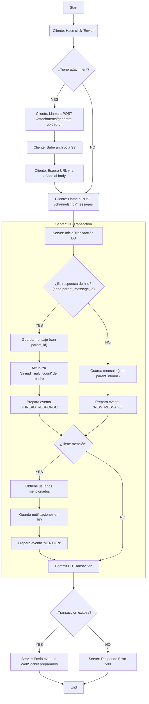
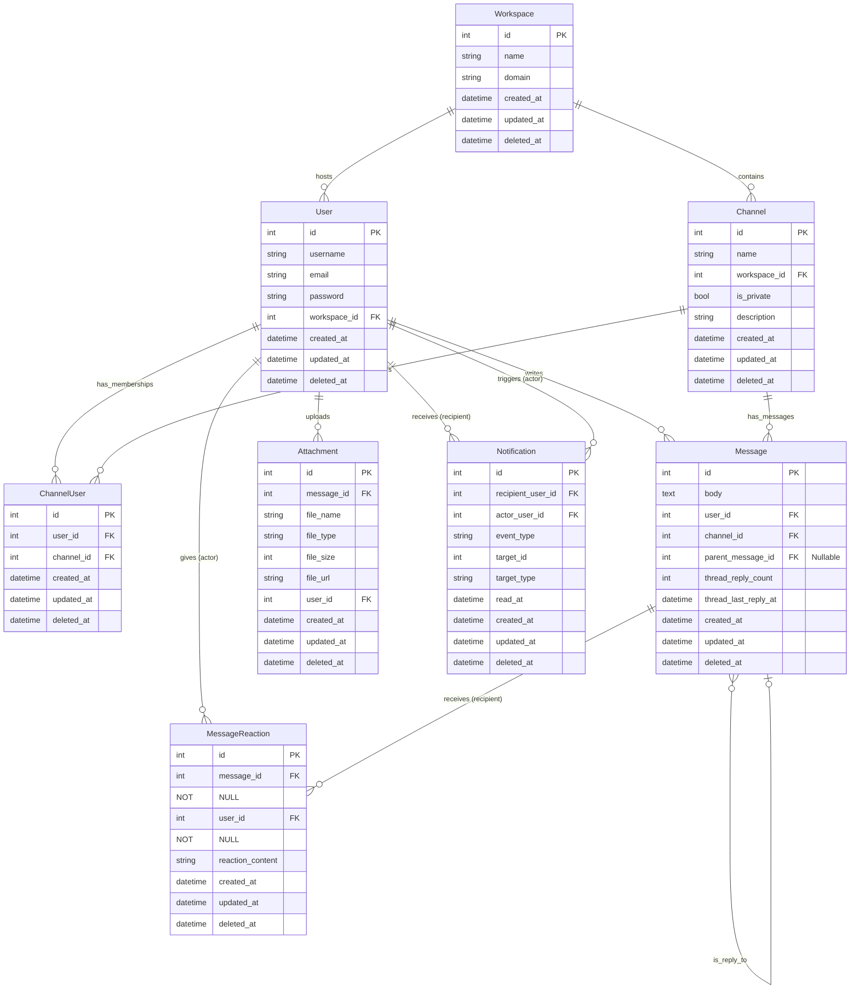

## Introduction

This document describes a technical design for the backend API for a real-time messaging application (similar to Slack). This API manages authentication, authorization, workspaces, channels, messages, attachments with a system that saves the files in a service like S3 and allows for a centralized notification system.

## Key Objectives

- Provide a scure and scalable RESTful API.
- Provide a communication service and a centralized notification service for clients.
- Allow a real-time communication with the use of a WebSocket service.
- Manage attachment storage with a decoupled service like S3.

## Use cases

### **Use Case 1: Team Channel Communication**

**Scenario:** A software development team needs to discuss the progress of a sprint in a dedicated channel.

**Flow:**

1. A team member posts an update in the #development channel.
2. Other members comment and react to the message.
3. A thread is created to discuss a specific task without interrupting the general conversation.
4. The team receives notifications for new messages and relevant mentions.

### **Use Case 2: Direct Messages Between Employees**

**Scenario:** A graphic designer needs to ask a developer for clarification about a specific functionality.

**Flow:**

1. The designer searches for the developer on the platform and sends a direct message.
2. The developer receives a notification and replies.
3. If necessary, they can escalate the conversation to a video call within the platform.

### **Use Case 3: Notifications and Mentions**

**Scenario:** A manager mentions an employee in a message to request an update.

**Flow:**

1. The manager writes a message in the #projects channel and mentions the employee with @name.
2. The employee receives a notification in their app.
3. The employee replies in the message thread.
4. The manager and other team members can follow and respond to the conversation as needed.

## High level solution

I propose a monolithic RESTful API, built using PHP/Laravel and PostgreSQL. It will use JWT Tokens for a secure and fast authentication, managing passwords with Bcrypt, and will implement a WebSocket service for real-time events. 

## Flow diagram

NEW MESSAGE

## Entity diagram

## Epics and Tasks

- EPIC: Authentication and user management
    Task1: Implement endpoint `POST /register/` with validations and password hashing using Bcrypt.
    Task2: Implement logic to create tokens using JWT with a secret_key
    Task3: Implement login logic, returning a JWT.
    Task4: Implement middleware for JWT verification and authorization for requested services.
    Task5: Implement endpoint `GET /users/{me}` to get the authenticated user's profile.
    Task6: Implement endpoint `PUT /users/{me}` to allow a user to update their own data.

- EPIC: Workspace Management
    Task1: Implement endpoint `POST /wokspaces` to create workspaces.
    Task2: Implement endpoint `PUT /workspaces/{workspace_id}` to update a workspace.
    Task3: Implement endpoint `GET /workspaces` to list all the workspaces.
    Task4: Implement endpoint `GET /workspaces/{wokspace_id}` to get specific workspace.
    Task5: Implement endpoint `DELETE /workspaces/id` to delete a workspace.
    Task6: Implement endpoint `POST /workspaces/{workspace_id}/members` to add a member to a workspace.
    Task7: Implement endpoint `GET /workspaces/{workspace_id}/members` to list all members in a workspace.
    Task8: Implement endpoint `DELETE /workspaces/{workspace_id}/members` to remove a user from the workspace.

- EPIC: Channel Management
    Task1: Implement endpoint `POST /workspaces/{workspace_id}/channels` to create a channel in a workspace.
    Task2: Implement endpoints `POST /channels/{channel_id}/members` and `DELETE /channels/{channel_id}/members/{user_id}` to add and remove members to/from a channel.
    Task3: Implement endpoint `GET /workspaces/{workspace_id}/channels` to list all the channels in a workspace.
    Task4: Implement endpoint `GET /channels/{channel_id}` to get a specific channel.
    Task5: Implement endpoint `PUT /channels/{channel_id}` to update a channel.
    Task6: Implement endpoint `DELETE /channels/{channel_id}` to delete a channel.

- EPIC: Message Management

    Task1: Implement thread logic using the`parent_message_id` attribute (to identify thread responses), and the `thread_reply_count` and `thread_last_reply_at` (for efficient thread management).
    Task2: Implement endpoint `POST /channels/{channel_id}/messages` to send new messages ( Note: THis logic must handle the attachments first using the `POST /attachments/generate-upload-url` service to obtain a pre-signed url for the request body).
    Task3: Implement logic to publish events in the WebSocket to notify clients.
    Task4: Implement endpoint `GET /channels/{channel_id}/messages` to get all  the messages from a channel.
        Subtask: Implement pagination for the messages (eg: `?limit=50&cursor=timestamp`).
    Task5: Implement endpoint `GET /messages/{message_id}/replies` to get all replies for a specific message.
    Task6: Implement endpoint `PUT /messages/{message_id}` to update a message.
    Task7: Implement endpoint `DELETE /messages/{messaage_id}` to delete a message.
    Task8: Implement endpoint `POST /dms/users/{user_id}/messages` to send direct messages.
        Subtask: The service logic must check if a DM channel already exists between the two users. If not, it must create one before saving the message.
    Task9: Implement endpoint `GET /dms/users/{user_id}/messages` to get the message history with a specific user.
    Task10: Implement endpoint `GET /dms` to list all of the authenticated user's direct message conversations.

- EPIC: Notification Management
    Task1: Implement endpoints `POST /channels/{channelId}/messages` and `PUT /messages/{message_id}` to detect `@mention`.
    Task2: When a mention is detected, create a new notification record in the database.
    Task2: Implement endpoint `GET /notifications` to get all notifications from the authenticated user (sorted and filtered). 
    Task3: Implement endpoint `PUT /notifications/{notification_id}` to mark a notification as read (by setting the `read_at` attribute).
    Task5: Implement logic to publish a WebSocket event to the client when a notification is created.

- EPIC: Attachment management
    Task1: Implement endpoint `POST /attachments/generate-upload-url` to create a pre-signed URL uploading files directly to a service like `AWS S3` (This allows the client to upload the file, which then provides the final file URL needed for the message).

- EPIC: Message reactions management
    Task1: Implement endpoint `POST /messages/{message_id}/reactions` to add a reaction to a message (e.g., an ASCII character, emoji, or custom icon).
    Task2: Implement endpoint `DELETE:/message/{message_id}/reactions/{reaction_id}` to delete a specific reaction (Note: The reaction to be removed should be identified in the request body).
    Task3: Implement endpoint `GET /messages/{message_id}/reactions` to list all the reaction on a message.
    Task4: Implement logic to publish a WebSocket event to notify the client when a reaction has been added or removed.

## Upgrades
. Advanced search.
. Status (Online/Offline/Busy/Out of office).
. Add rol for "guest" users with limited permissions for workspace access.
